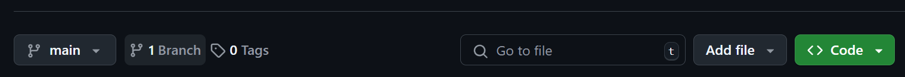
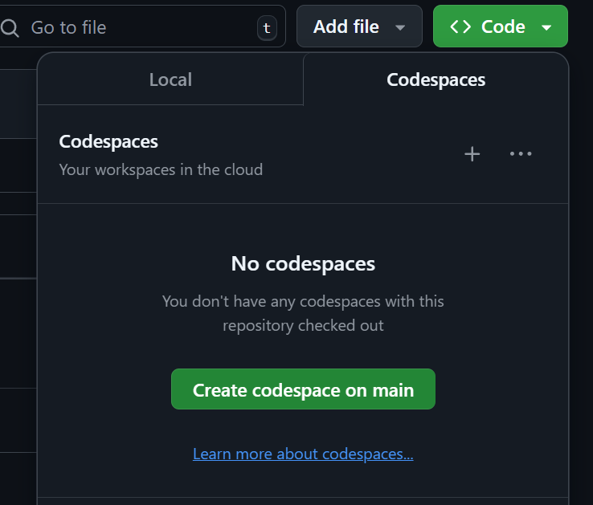
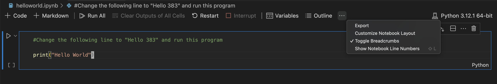
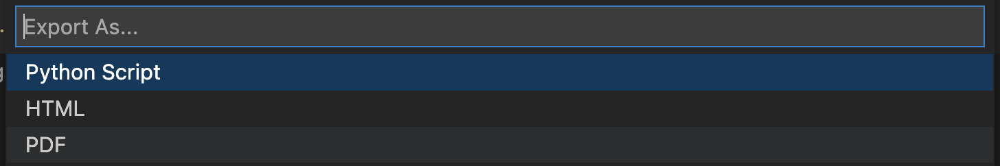

# Assignment 0 - HelloWorld

## Assignment Objectives

* Increase familiarity with Github Classroom/Codespace and course's Gradescope Submission process.

## Pre-requisites

* Knowledge of Github, Jupyter notebook.

## Overview

* For this assignment, you are to get familiarized with Github Classroom as well as the submission process on Gradescope for our course. Follow the instructions below to modify, run a simple "hello world" program and include the output in your Gradescope submission.

## Starter Code

* helloworld.ipynb

## Workflow

* You can then clone this repository and proceed with the assignment locally. Instructions on how to clone the repository can be found here: https://docs.github.com/en/repositories/creating-and-managing-repositories/cloning-a-repository

* Alternatively, you can proceed with the assignment via Codespace, below is the instructions on how to do so : 

    1. **Open in Codespace:**
       * Click on the green "<> Code" button.
         
        
         
        * In the dropdown box, there should be an option to "Codespace" button. Click that, and then click the green "Create codespace on main"
         
        
         
    
    3. **Wait for Setup:** GitHub will set up a cloud-based development environment with all the necessary tools. This might take a few minutes.
    4. **Start Coding:** Once the Codespace is ready, you'll have a full VS Code editor in your browser, with the repository code loaded and ready to go. You can now start working on the assignment!
    5. **Commit/Save changes:** Remember to **commit** your changes (in the same way you normally do) before exiting the codespace environment. 
    6. **Codespaces:** Codespaces would make it much easier for you to start the assignment in one-click as you wouldn't have to manually clone the project in your local. Also becuase this project includes the use of Jupyter notebooks, you wouldn't have to worry about having a local Jupyter notebook environment when your working on GitHub codespaces.
    
    **Important Notes:**
    
    * You'll need a GitHub account and may need to enable Codespaces in your settings.
    * There might be limitations on Codespaces usage depending on your GitHub plan.
    * Make sure you save your work regularly, as Codespaces might time out after a period of inactivity.

## Instructions

- Modify the print statement to "Hello 383" and run the program.

## Submissions
- Make sure to commit and push your changes before submitting. Details can be found here: https://code.visualstudio.com/docs/sourcecontrol/overview#_commit
- Make sure to include your repo URL and commit ID at the beginning of your notebook.
- To make a submission for the project, export your notebook that includes outputs to a pdf.
    - If you are using CodeSpace, download your notebook locally by right clicking on your ipynb file and select Download. Then proceed with the steps below.
    - Open your notebook on VSCode, if you have not used it before, download here: https://code.visualstudio.com/Download
    - Click on the three-dot symbol at the top of your notebook and click on Export.
     
    
     
    
    - Among the export options, click on HTML.
     
    
     
    
    - Open the HTML file on your browser and use the "Print to PDF" feature to save your PDF.
- Include the pdf in your Gradescope submission, ensuring specific pages are assigned to each question.

---
